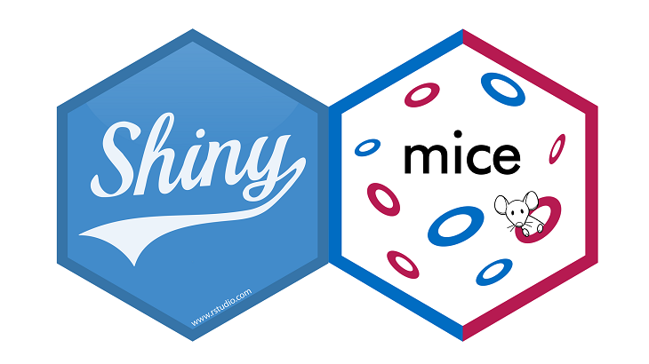
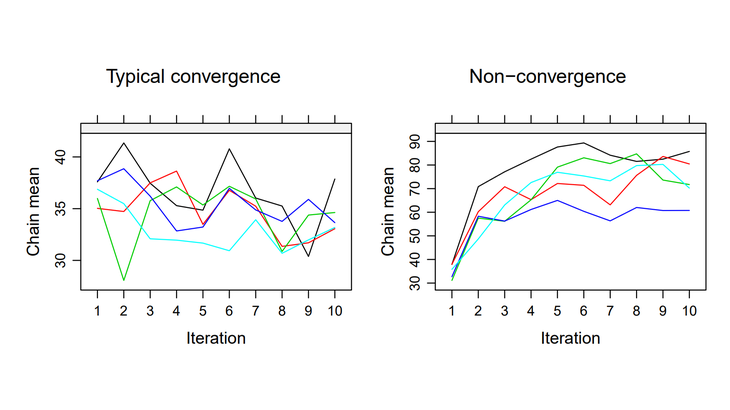

# Aggrey M. Muhebwa
I am a fifth year (yes, 5 years) Ph.D student in Electrical and Computer Engineering at the University of Massachusetts Amherst where I am a member of STIMA Lab, and honored to be advised by Prof. jay Taneja.  
I am a [UN-IPCC](https://www.ipcc.ch/) scholar, an [e-GUIDE](https://eguide.io/) fellow and part of 
[DAWG](https://swot.jpl.nasa.gov/documents/4050/) - a consortium of scientists building both physics-based and machine learning algorithms for the upcoming NASA SWOT Mission.  
I completed my masters degree in Electrical and Computer Engineering from Carnegie Mellon University, and a bachelors degree in Computer Engineering from Makerere University.

 

## Experience

If you'd like to know more about my background and education, check out my [LinkedIn profile](https://www.linkedin.com/in/amuhebwa/) or [CV](https://amuhebwa.github.io/muhebwa_CV).

 

## Research

For an overview of my published work, see my [ORCiD page](https://orcid.org/0000-0003-3276-2141). Other places to find my research output are my [Utrecht University page](https://www.uu.nl/staff/HIOberman), [OSF](https://osf.io/d8c5f/), and [Google Scholar](https://scholar.google.nl/citations?user=myLQXrEAAAAJ). I post all of my ongoing work on [GitHub](https://github.com/hanneoberman). 

Some examples of my research:

- Work in progress on [{shinymice}](https://hanneoberman.shinyapps.io/shinymice-demo/), an online evaluation suite for missing data. 

- My MSc thesis [Missing the Point: Non-Convergence in Iterative Imputation Algorithms](https://openreview.net/pdf?id=fHSVg6mVqpw), presented at ICML 2020 (ARTEMISS workshop).

